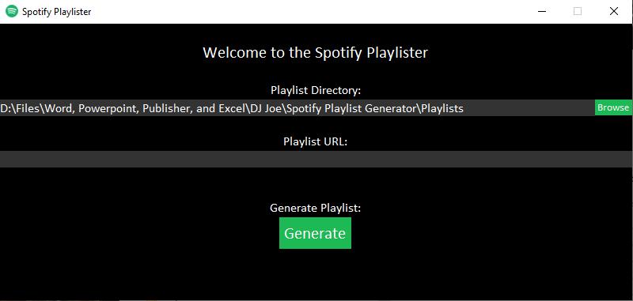

# Spotify Playlist Interpreter and List Generator

A simple Python 3 script capable of reading Spotify playlists
and generating a text file including the track titles, artists,
and a boolean indicator for explicit content.

### Dependencies:
- Spotipy: https://spotipy.readthedocs.io/en/latest/